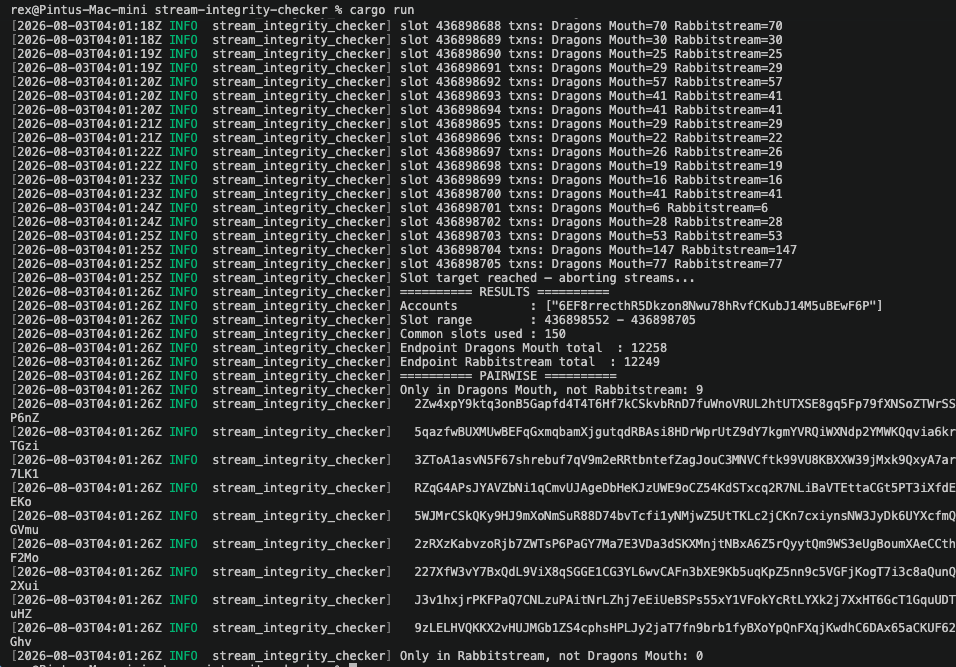

# stream-integrity-checker

Compare tx delivery across multiple Yellowstone gRPC/RabbitStream endpoints — catch missing/duplicate/out-of-order signatures between streams.

## What it does

Subscribes to N Geyser/RabbitStream endpoints in parallel, same account filter each. Buckets received tx signatures per slot per endpoint. Once every endpoint has `num_slots + 2` slots recorded, stops and diffs results:

- common slot range across all endpoints
- total unique sigs per endpoint (over common slots)
- pairwise: sigs seen on endpoint A but missing from endpoint B

Use case: confirm two RPC/gRPC providers (e.g. Dragons Mouth vs Rabbitstream) give consistent data — no dropped txns.

## How it works (src/main.rs)

- `Config` — deserialized from `config.yml`: list of endpoints (url, optional x_token, optional label), account filter list, `num_slots` target.
- `label_for(i)` — auto-labels endpoints A, B, C... if no `label` given (spreadsheet-column style).
- `stream_txns()` — one per endpoint, spawned as a tokio task. Opens `GeyserGrpcClient`, subscribes with `SubscribeRequestFilterTransactions` (account_include = configured accounts, commitment = Confirmed). Every tx received → `bs58`-encode signature, insert into `BTreeMap<slot, HashSet<sig>>` behind an `Arc<Mutex<_>>` shared with main.
- Main loop (200ms poll):
  - tracks `max_slot` = min of each endpoint's latest slot (i.e. the slot all endpoints have at least reached)
  - for any not-yet-logged slot below that watermark, if all endpoints have an entry, logs per-endpoint tx count for that slot
  - exits once every endpoint has recorded `num_slots + 2` slots
- Shutdown: aborts all stream tasks, drops first/last common slot (edge effects), unions sig sets per endpoint over the remaining common slots, then prints:
  - per-endpoint totals
  - pairwise "only in A, not B" diffs with the actual missing signatures

## Setup

```bash
cd Rabbitstream/General-rabbitstream-examples/Rust/stream-integrity-checker
cp config-sample.yml config.yml
```

Edit `config.yml`:

```yaml
endpoints:
  - url: "https://grpc.ams.shyft.to"
    x_token: "AUTH_TOKEN"   # remove line if no auth needed
    label: "Dragons Mouth"
  - url: "https://rabbitstream.ams.shyft.to"
    x_token: "AUTH_TOKEN"
    label: "Rabbitstream"
accounts:
  - "6EF8rrecthR5Dkzon8Nwu78hRvfCKubJ14M5uBEwF6P"   # empty list = all accounts
num_slots: 150
```

## Run

```bash
RUST_LOG=info cargo run --release
```

`RUST_LOG=debug` adds per-tx log lines (slot + sig) as they arrive — noisy, only for close inspection.

## Output

```
========== RESULTS ==========
Accounts          : ["6EF8rrecthR5Dkzon8Nwu78hRvfCKubJ14M5uBEwF6P"]
Slot range        : 123456 - 123604
Common slots used : 147
Endpoint Dragons Mouth total  : 812
Endpoint Rabbitstream total   : 810

========== PAIRWISE ==========
Only in Dragons Mouth, not Rabbitstream: 2
  5x7f...sig1
  8q2k...sig2
Only in Rabbitstream, not Dragons Mouth: 0
```

Non-zero pairwise counts = one endpoint dropped/delayed txns the other caught. Zero both ways = streams agree over the sampled window.


